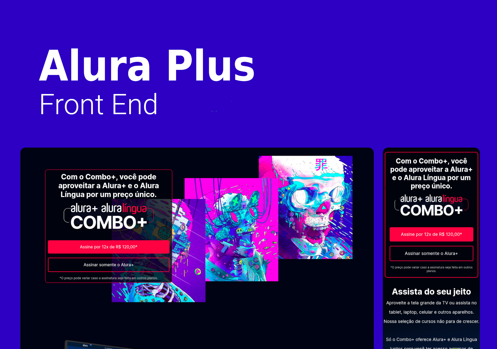

# Alura Plus | Front End

> Incorporating the Alura Plus Layout created in figma to HTML5 and CSS3, using techniques such as the grid layout to 
divide the screen into two columns, and removing it in the mobile version. Also establishing well-defined sections.
